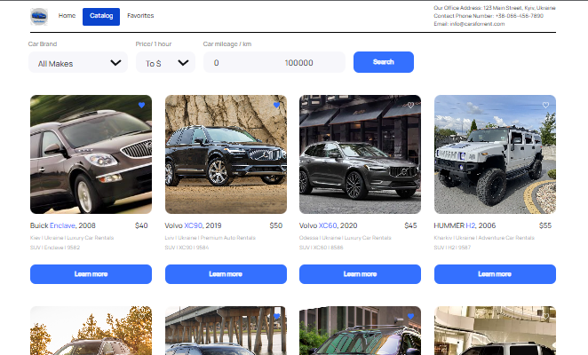

# Car for rent
### About the project
This application was created to provide car rental services in Ukraine. On the website you can choose a suitable car and book it. Sort by car brand, mileage, price. It is possible to add a car to your favorite one.

Home page with a general description of the services provided by the company.

Catalog - page containing a catalog of cars with different configurations.

Favorites - page with listings that have been added to favorites by the user.


### Functional capabilities:
* You can sort the cars by car brand, mileage, price.
* You can add cars you are interested in to your favorites.
* You can find out the detailed characteristics of the car by clicking on the button "Learn more".
* You can rent a car by clicking on the button "Rental car".


For development, a backend was used on the UI service https://mockapi.io/.


## Deploy

The frontend part of the web-app is deployed on gh-pages.
[Live version of the app](https://dolbina.github.io/ukraine-rent-car/) is avaliable by the web-address

```javascript
"https://github.com/Dolbina/ukraine-rent-car";
```

### The technology stack used in the project:

<code></code>
<code></code>
<code></code>
<code></code>
<code></code>
<code></code>
<code></code>
<code></code>
<code></code>
<code></code>
